# RO_012 - TP Filtrage de Kalman

## Q1

Le code étudié met en œuvre un filtre de Kalman étendu (EKF) appliqué à la localisation d’un robot mobile à partir de mesures d’odométrie et d’observations de balises fixes. Il est organisé en plusieurs parties qui reproduisent la chaîne complète d’un système de navigation robotique. Tout d’abord, la partie de simulation du véhicule représente le « monde réel » : elle calcule la trajectoire vraie du robot à partir des commandes de mouvement et y ajoute des bruits afin de simuler les incertitudes des capteurs. Cette section gère aussi la génération de données d’odométrie et de mesures de balises bruitées. Ensuite, le code contient les modèles mathématiques du mouvement et de l’observation, qui décrivent respectivement comment le robot se déplace et comment il perçoit les balises en fonction de sa position. Ces équations sont linéarisées à chaque étape à l’aide des Jacobiennes, indispensables au fonctionnement du filtre de Kalman étendu.

La boucle principale du programme exécute, à chaque pas de temps, la prédiction de la position du robot à partir de l’odométrie, puis la correction de cette estimation dès qu’une mesure de balise est disponible. Le filtre utilise pour cela les matrices de covariance des bruits de mouvement et de mesure (Q et R), ainsi que la covariance de l’estimation P, qui reflète l’incertitude du robot sur sa position. Enfin, le code affiche et compare les trajectoires réelle, odométrique et estimée, permettant d’évaluer la performance du filtre. En résumé, le programme est structuré autour de deux volets principaux : la simulation du comportement physique du robot et de ses capteurs, et l’algorithme d’estimation du filtre de Kalman étendu, qui combine prédiction et correction pour améliorer la précision de la localisation.

## Q2

Le fichier EKFLocalization.py a été complété afin d’intégrer l’ensemble des équations du filtre de Kalman étendu (EKF). Le modèle dynamique, le modèle de mesure ainsi que les matrices jacobiennes associées ont été implémentés conformément aux équations du cours.

Le résultat de la simulation avec les données initiales peut être observé dans la figure suivante.

  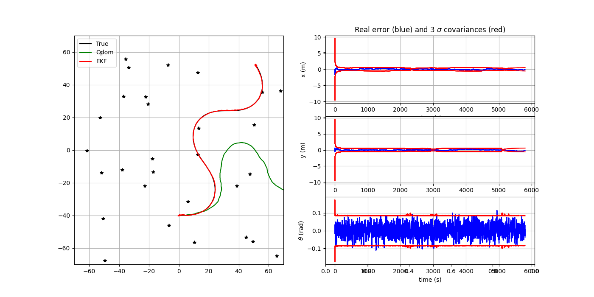
   
  <em>Figure 1 – Résultat Initial </em>

Pour cette simulation, on peut constater que la trajectoire réelle et la trajectoire du filtre sont très proches, pratiquement identiques, avec une erreur faible.

## Q3

Ici sont présentées quelques simulations résultant de la variation de la fréquence de mesure

  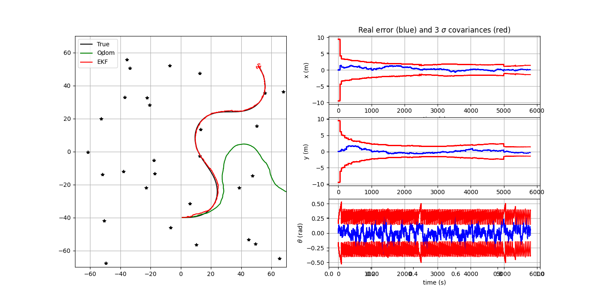
   
  <em>Figure 2 – Variation de la fréquence de mesure dt_meas = 50 </em>

  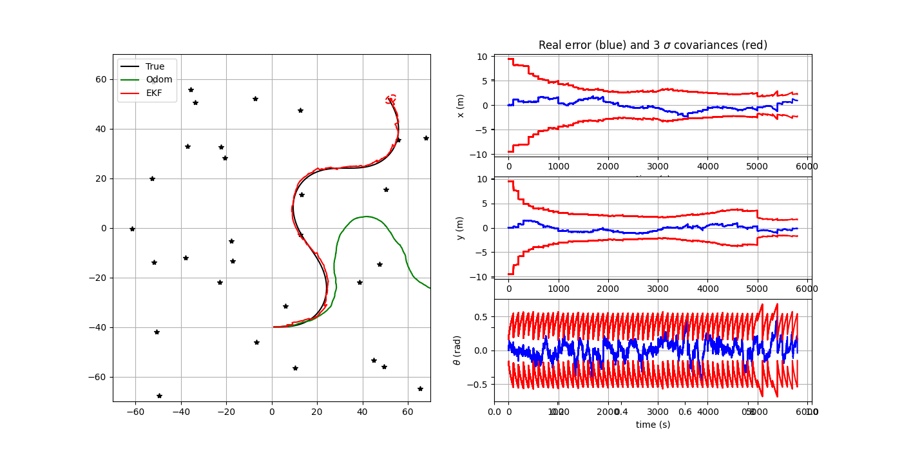
   
  <em>Figure 3 –  Variation de la fréquence de mesure dt_meas = 100 </em>

  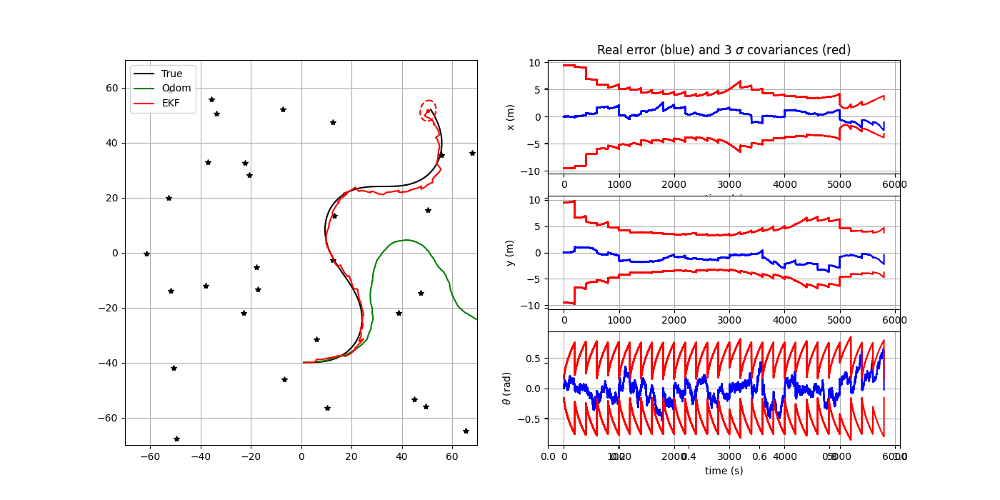
   
  <em>Figure 4 –  Variation de la fréquence de mesure dt_meas = 200 </em>

On peut voir que l’allongement de l’intervalle entre les mesures provoque une dégradation notable de la trajectoire, traduisant une diminution de la précision du calcul effectué par le filtre de Kalman. Cette dégradation se manifeste à travers plusieurs éléments, tels qu’une augmentation des erreurs sur les états du système, une hausse de l’écart-type et un élargissement de l’ellipse de covariance. Cette situation s’explique par le fait qu’un intervalle de mesure plus long entraîne davantage d’itérations entre deux observations successives, ce qui favorise l’accumulation des erreurs et, par conséquent, une détérioration des performances globales du filtre de Kalman.

## Q4

Ici on peut voir des simulations en faisant varier le bruit dynamique du filtre (QEst):

  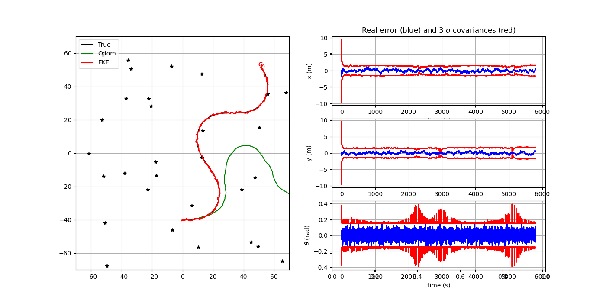
   
  <em>Figure 5 – Variation du bruit dynamique du filtre QEst = 50 </em>

  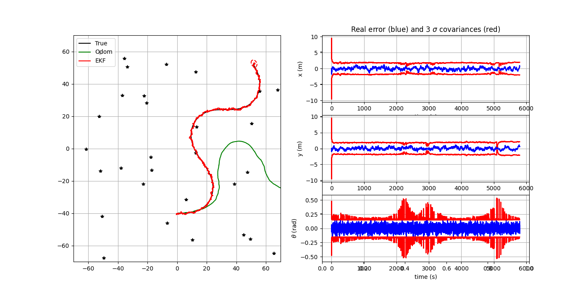
   
  <em>Figure 6 –  Variation du bruit dynamique du filtre QEst = 100 </em>

  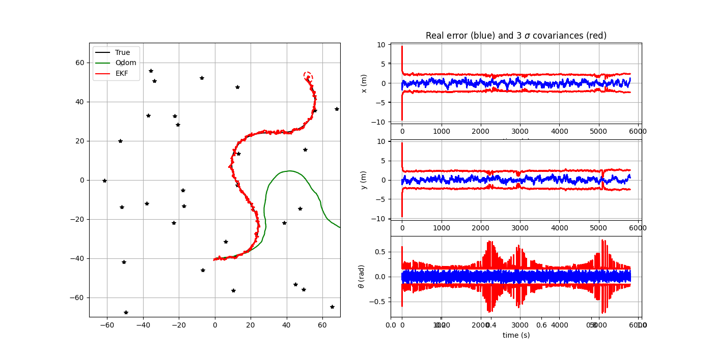
   
  <em>Figure 7 –  Variation du bruit dynamique du filtre QEst = 200 </em>

On observe qu’une élévation du bruit dynamique engendre une plus grande variabilité des résultats. Autrement dit, bien que l’erreur de calcul du filtre de Kalman ne croisse pas de façon marquée, les estimations deviennent davantage sujettes à des fluctuations d’une itération à l’autre, ce qui se traduit par des courbes présentant une moindre régularité et une apparence plus agitée.

## Q5

Ici on peut voir des simulations en faisant varier le bruit de mesure du filtre (REst):

  
   
  <em>Figure 8 – Variation du bruit de mesure du filtre REst = 50 </em>

  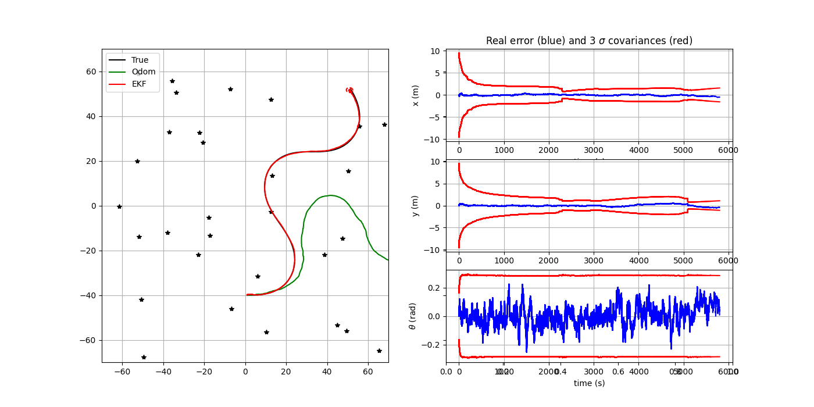
   
  <em>Figure 9 –  Variation du bruit de mesure du filtre REst = 100 </em>

  
   
  <em>Figure 10 –  Variation du bruit de mesure du filtre REst = 200 </em>

On remarque que lorsque le bruit de mesure s’intensifie, la dispersion des observations devient plus importante, même si l’erreur globale reste pratiquement inchangée. Par ailleurs, l’augmentation de la covariance associée à la position se traduit par une expansion de l’ellipse de confiance, alors que la trajectoire générale conserve une forme globalement stable et peu affectée.

## Q6

Ici on peut voir une simulation d'un trou de mesures entre 2500 et 3500 secondes:

  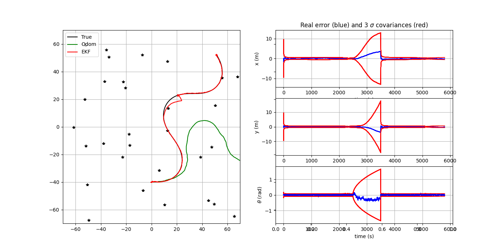
   
  <em>Figure 11 – Simulation d'un trou notValidCondition = true </em>

Il apparaît clairement que, pendant l’interruption des mesures entre 2500 et 3000 secondes (en comparaison avec la simulation initiale où notValidCondition = false sur la figure Q2), on observe une augmentation de l’erreur ainsi que de la covariance, conséquence directe de l’absence de correction par le filtre de Kalman. Toutefois, dès que les mesures sont rétablies, le filtre reprend son fonctionnement normal, ajuste progressivement les estimations et parvient, après quelques itérations, à retrouver un état similaire à celui de la simulation complète.

## Q7

Ici on peut voir des simulations en faisant varier le nombre d'amers sur la carte (nLandmarks):

  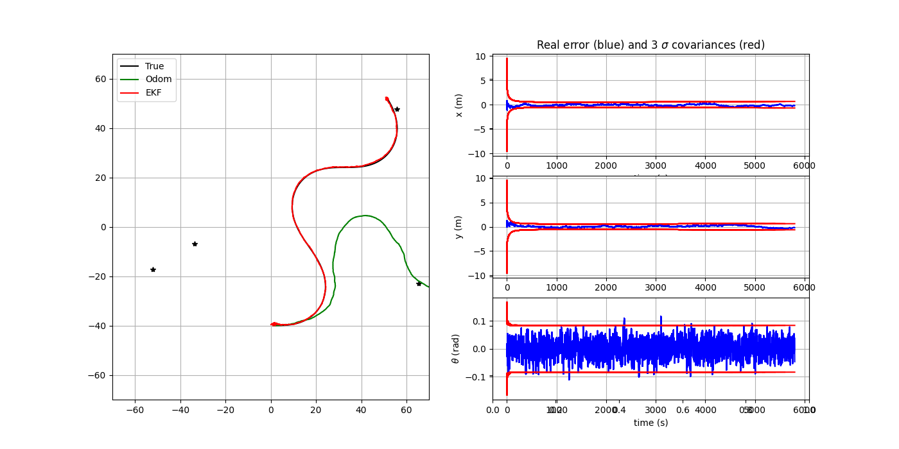
   
  <em>Figure 12 – nLandmarks = 4 </em>

  
   
  <em>Figure 13 –  nLandmarks = 100 </em>

  
   
  <em>Figure 14 – nLandmarks = 200 </em>

On constate qu’en accroissant le nombre d'amers dans l’environnement de simulation, les performances du filtre de Kalman s’améliorent légèrement : l’erreur, la covariance et la taille de l’ellipse diminuent, signe d’un fonctionnement plus précis de l’algorithme. Cette amélioration s’explique sans doute par une meilleure sélection des références, offrant un compromis optimal entre erreurs angulaires et erreurs de distance, les premières dominant à grande portée, les secondes à faible distance.

## Q8

Ici on peut voir des simulations où seulement les mesures de distance sont disponibles et aussi en faisant varier le nombre d'amers sur la carte (nLandmarks):

  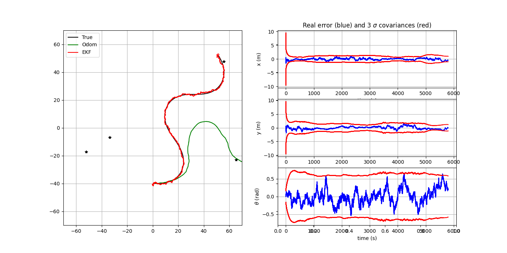
   
  <em>Figure 15 – nLandmarks = 4 </em>

  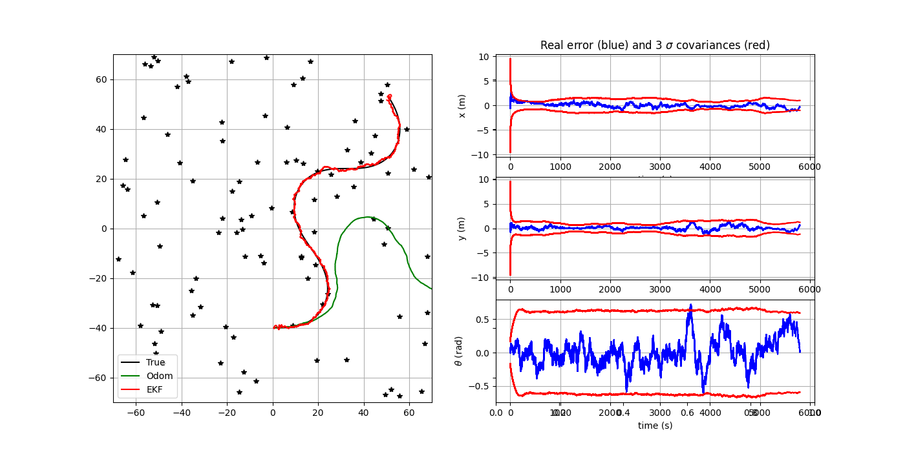
   
  <em>Figure 16 –  nLandmarks = 100 </em>

  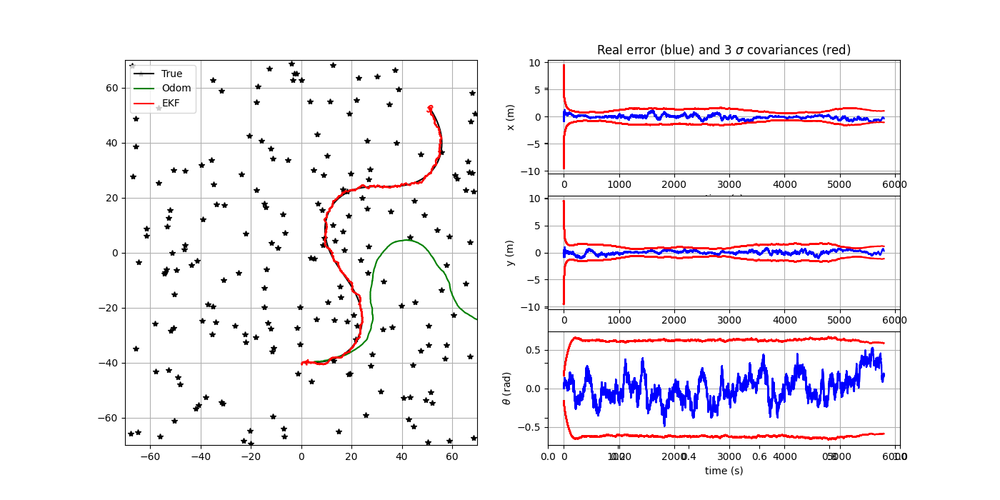
   
  <em>Figure 17 –  nLandmarks = 200 </em>

On observe que lorsque seules les mesures de distance sont utilisées pour le filtre de Kalman, les résultats deviennent plus fluctuants, avec une variance plus élevée pour tous les états et une trajectoire moins lisse. Cependant, le filtre reste précis, l’aire de l’ellipse ne montrant pas de différence significative par rapport au cas de référence. Ainsi, le nombre de références sur la carte n’a pas d’impact majeur sur le fonctionnement du filtre.

## Q9

Ici on peut voir des simulations où seulement les mesures de direction sont disponibles et aussi en faisant varier le nombre d'amers sur la carte (nLandmarks):

  
   
  <em>Figure 18 – nLandmarks = 4 </em>

  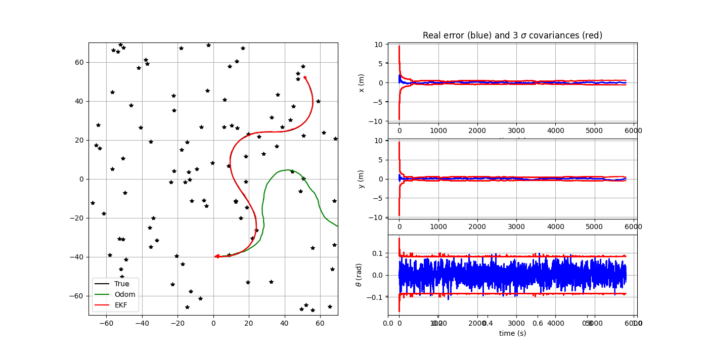
   
  <em>Figure 19 –  nLandmarks = 100 </em>

  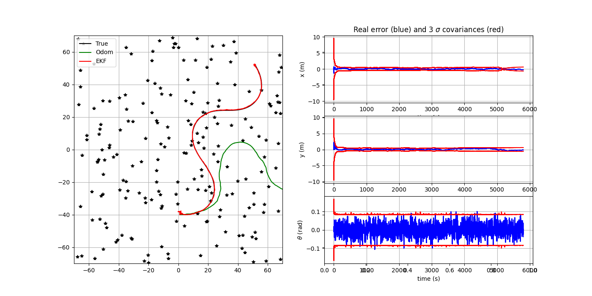
   
  <em>Figure 20 –  nLandmarks = 200 </em>

On constate que lorsque seules les mesures d’angle sont utilisées dans le filtre de Kalman, la trajectoire reste globalement stable, malgré une augmentation de la variance qui réduit la confiance dans l’estimation. Contrairement au cas des distances, l’ajout de références supplémentaires améliore nettement la précision de la trajectoire, montrant que les mesures d’angle sont particulièrement sensibles à la présence de références dans la simulation.
