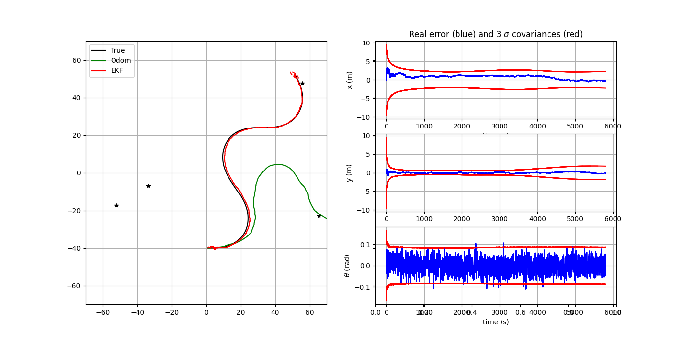

# RO_012 - TP Filtrage de Kalman

## Q1

Le code étudié met en œuvre un filtre de Kalman étendu (EKF) appliqué à la localisation d’un robot mobile à partir de mesures d’odométrie et d’observations de balises fixes. Il est organisé en plusieurs parties qui reproduisent la chaîne complète d’un système de navigation robotique. Tout d’abord, la partie de simulation du véhicule représente le « monde réel » : elle calcule la trajectoire vraie du robot à partir des commandes de mouvement et y ajoute des bruits afin de simuler les incertitudes des capteurs. Cette section gère aussi la génération de données d’odométrie et de mesures de balises bruitées. Ensuite, le code contient les modèles mathématiques du mouvement et de l’observation, qui décrivent respectivement comment le robot se déplace et comment il perçoit les balises en fonction de sa position. Ces équations sont linéarisées à chaque étape à l’aide des Jacobiennes, indispensables au fonctionnement du filtre de Kalman étendu.

La boucle principale du programme exécute, à chaque pas de temps, la prédiction de la position du robot à partir de l’odométrie, puis la correction de cette estimation dès qu’une mesure de balise est disponible. Le filtre utilise pour cela les matrices de covariance des bruits de mouvement et de mesure (Q et R), ainsi que la covariance de l’estimation P, qui reflète l’incertitude du robot sur sa position. Enfin, le code affiche et compare les trajectoires réelle, odométrique et estimée, permettant d’évaluer la performance du filtre. En résumé, le programme est structuré autour de deux volets principaux : la simulation du comportement physique du robot et de ses capteurs, et l’algorithme d’estimation du filtre de Kalman étendu, qui combine prédiction et correction pour améliorer la précision de la localisation.

## Q2

Le fichier EKFLocalization.py a été complété afin d’intégrer l’ensemble des équations du filtre de Kalman étendu (EKF). Le modèle dynamique, le modèle de mesure ainsi que les matrices jacobiennes associées ont été implémentés conformément aux équations du cours.

Le résultat de la simulation avec les données initiales peut être observé dans la figure suivante.

  
   
  <em>Figure 1 – Résultat Initial </em>

Pour cette simulation, on peut constater que la trajectoire réelle et la trajectoire du filtre sont très proches, pratiquement identiques, avec une erreur faible.

## Q3

Ici sont présentées quelques simulations résultant de la variation de la fréquence de mesure

  
   
  <em>Figure 2 – Variation de la fréquence de mesure dt_meas = 50 </em>

  
   
  <em>Figure 3 –  Variation de la fréquence de mesure dt_meas = 100 </em>

  
   
  <em>Figure 4 –  Variation de la fréquence de mesure dt_meas = 200 </em>

## Q4

## Q5

## Q6

## Q7

## Q8

## Q9

