# RO_012 - TP Filtrage Particulaire

## Q1

Le programme met en place un filtre particulaire pour localiser un robot mobile en 2D. Le simulateur crée une trajectoire vraie, calcule l’odométrie bruitée et génère des mesures de capteur à partir d’amers connus. Le modèle de mouvement utilise une commande avec du bruit pour prédire la nouvelle position des particules. Le modèle d’observation calcule la distance et l’angle entre le robot et un amer. À chaque pas de temps, les particules sont déplacées selon la commande, puis pondérées en fonction de la vraisemblance de la mesure. Les poids sont ensuite normalisés. L’estimation de la position du robot est obtenue par la moyenne pondérée des particules. Si le nombre effectif de particules devient trop faible, un rééchantillonnage est effectué pour éviter la dégénérescence. Le code distingue les paramètres réels (QTrue, RTrue) utilisés pour simuler le monde et les paramètres estimés (QEst, REst) utilisés par le filtre. Des fonctions utilitaires gèrent les calculs trigonométriques, les intégrations et l’affichage des trajectoires. Au fil du temps, le filtre ajuste la distribution des particules pour suivre la position réelle du robot.

## Q2

Le fichier ParticleFilter.py a été complété afin d’intégrer l’ensemble des équations du filtre particulaire (PF). Le modèle dynamique, le modèle de mesure ainsi que le prédiction, correction et ré-echantillonnage associées ont été implémentés conformément aux équations du cours.

Le résultat de la simulation avec les données initiales peut être observé dans la figure suivante.

  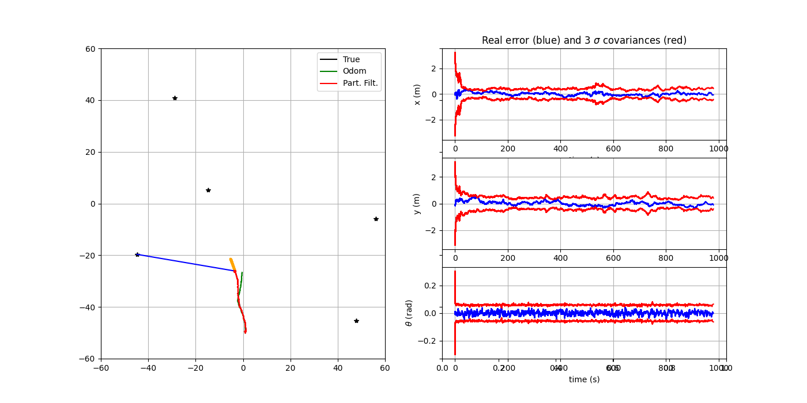
   
  <em>Figure 1 – Résultat Initial </em>

Pour cette simulation, on peut constater que la trajectoire réelle et la trajectoire du filtre sont très proches, pratiquement identiques, avec une erreur faible.

## Q3

Ici on peut voir des simulations en faisant varier le bruit dynamique du filtre (QEst):

  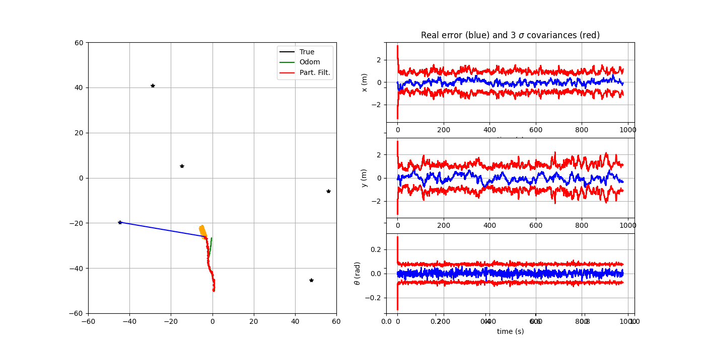
   
  <em>Figure 2 – Variation du bruit dynamique du filtre QEst = 50 </em>

  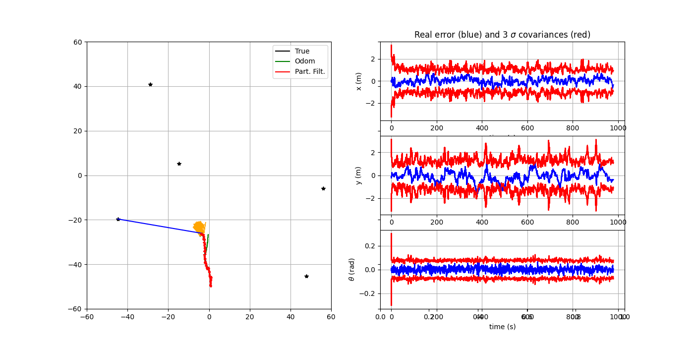
   
  <em>Figure 3 –  Variation du bruit dynamique du filtre QEst = 100 </em>

  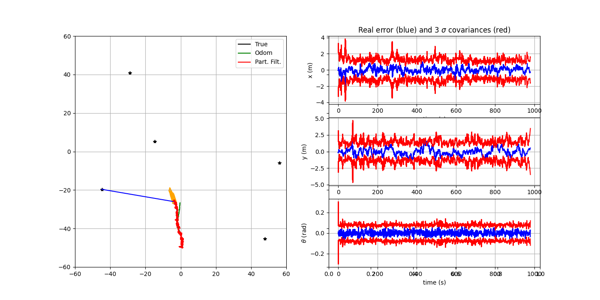
   
  <em>Figure 4 –  Variation du bruit dynamique du filtre QEst = 200 </em>

On observe qu’une élévation du bruit dynamique engendre une plus grande variabilité des résultats. Autrement dit, l’erreur de calcul du filtre de Kalman ne croisse pas de façon marquée, les estimations deviennent davantage sujettes à des fluctuations d’une itération à l’autre, ce qui se traduit par des courbes présentant une moindre régularité et une apparence plus agitée. Dans les cas où QEst est trop grand, un bruit excessif conduit à une estimation instable, même si celle-ci reste possible.

## Q4

Ici on peut voir des simulations en faisant varier le bruit de mesure du filtre (REst):

  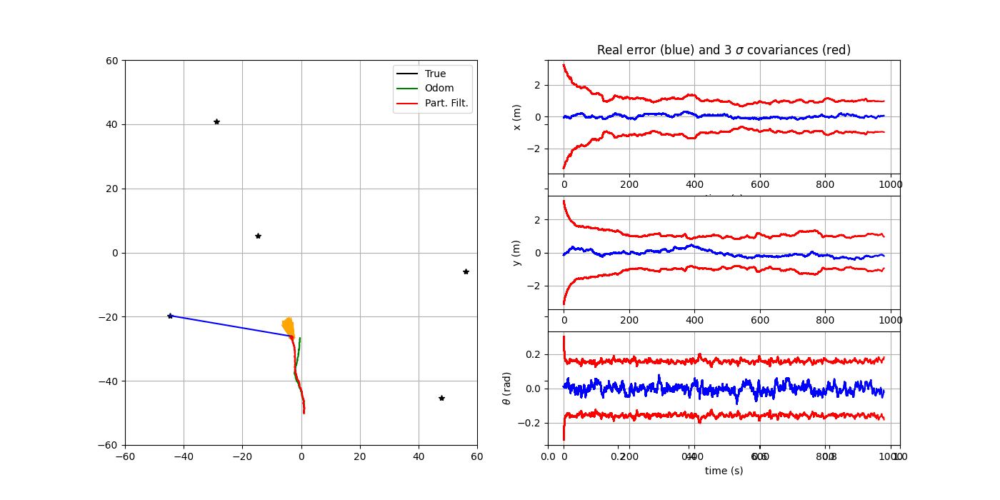
   
  <em>Figure 5 – Variation du bruit de mesure du filtre REst = 50 </em>

  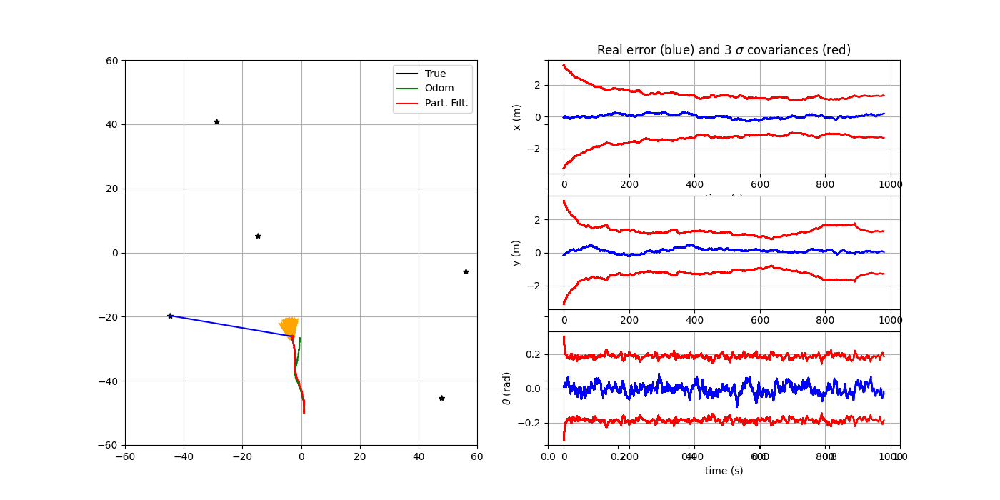
   
  <em>Figure 6 –  Variation du bruit de mesure du filtre REst = 100 </em>

  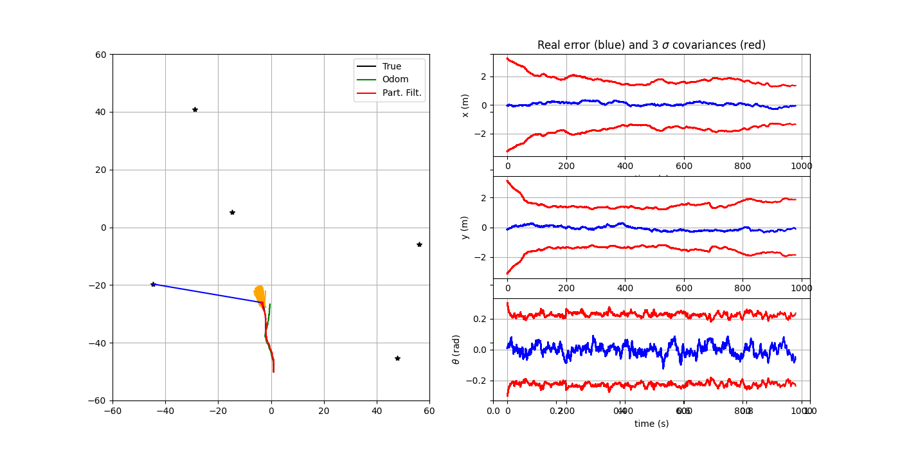
   
  <em>Figure 7 –  Variation du bruit de mesure du filtre REst = 200 </em>

On remarque que lorsque le bruit de mesure s’intensifie, la dispersion des observations devient plus importante, même si l’erreur globale reste pratiquement inchangée. Par ailleurs, l’augmentation de la covariance associée à la position se traduit par une expansion de l’ellipse de confiance, alors que la trajectoire générale conserve une forme globalement stable et peu affectée.

## Q5 

La variation du seuil de ré-échantillonnage (\theta_{\mathrm{eff}}) met clairement en évidence l’impact de ce paramètre sur le comportement du filtre particulaire. On peut voir ça dans la figure suivant.

  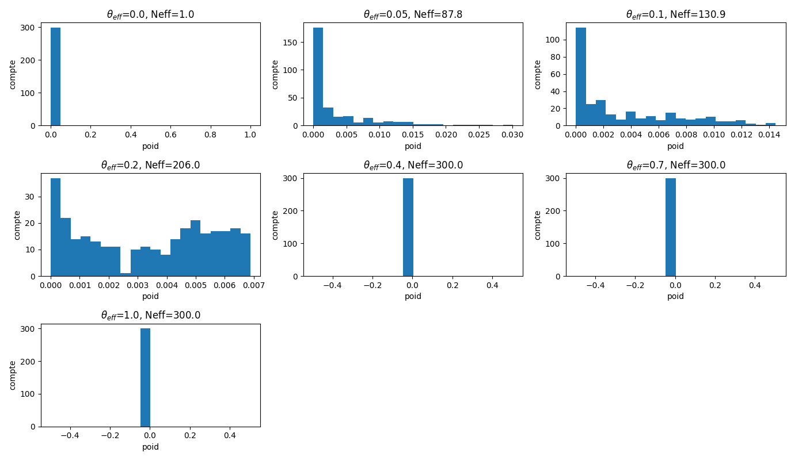
   
  <em>Figure 8 – Variation de theta_eff </em>

Pour des valeurs faibles, les histogrammes des poids sont très déséquilibrés : quelques particules ont des poids élevés, les autres sont presque nulles. Cela correspond à une dégénérescence du filtre, avec une forte perte de diversité et une baisse de N_eff.

Pour une valeur intermédiaire (theta_eff approx 0.2), la distribution des poids devient plus équilibrée et N_eff augmente. Le ré-échantillonnage intervient alors au bon moment, maintenant la diversité tout en limitant la concentration excessive.

Pour des valeurs élevées (theta_eff >= 0.4), les poids deviennent presque uniformes et N_eff atteint son maximum. Cela empêche la dégénérescence, mais un ré-échantillonnage trop fréquent peut réduire la diversité des particules.

Ainsi, un seuil trop bas favorise la dégénérescence, tandis qu’un seuil trop haut peut induire une sur-représentation prématurée. Un compromis intermédiaire permet de maintenir une bonne précision tout en préservant la diversité.

## Q6

Ici on peut voir une simulation d'un trou de mesures entre 250 et 350 secondes:

  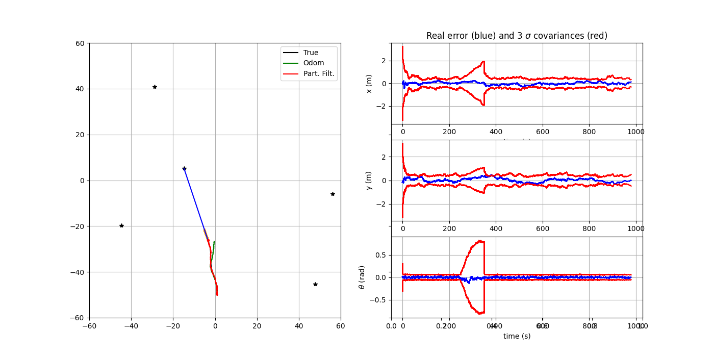
   
  <em>Figure 9 – Simulation d'un trou notValidCondition = true </em>

Lorsque les mesures sont coupées entre 250 s et 350 s, le filtre particulaire ne fait que la prédiction avec l’odométrie. L’incertitude augmente, les particules se dispersent et la trajectoire estimée dérive de la réalité. À la reprise des mesures, la mise à jour et le ré-échantillonnage permettent au filtre de se recaler rapidement sur la trajectoire vraie, réduisant l’erreur et resserrant les bandes d’incertitude.

## Q7

Ici sont présentées quelques simulations résultant de la variation de la fréquence de mesure

  
   
  <em>Figure 10 – Variation de la fréquence de mesure dt_meas = 10 </em>

Avec une fréquence de mesure réduite à 0,1 Hz (`dt_meas = 10` s), le filtre reçoit moins d’informations capteurs. L’incertitude augmente entre deux mesures et la trajectoire estimée suit davantage l’odométrie, ce qui amplifie la dérive. Les corrections deviennent plus rares, donc l’erreur reste plus élevée et les bandes d’incertitude sont plus larges, même si le filtre reste globalement stable.

## Q8

Ici on peut voir des simulations en faisant varier le nombre d'amers sur la carte (nLandmarks):

  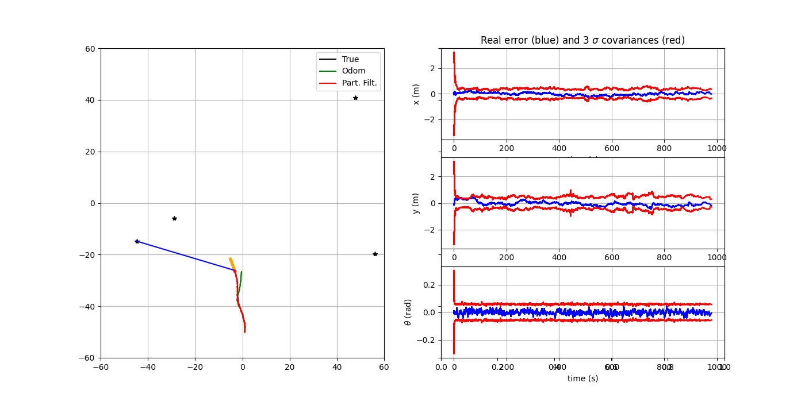
   
  <em>Figure 12 – nLandmarks = 4 </em>

  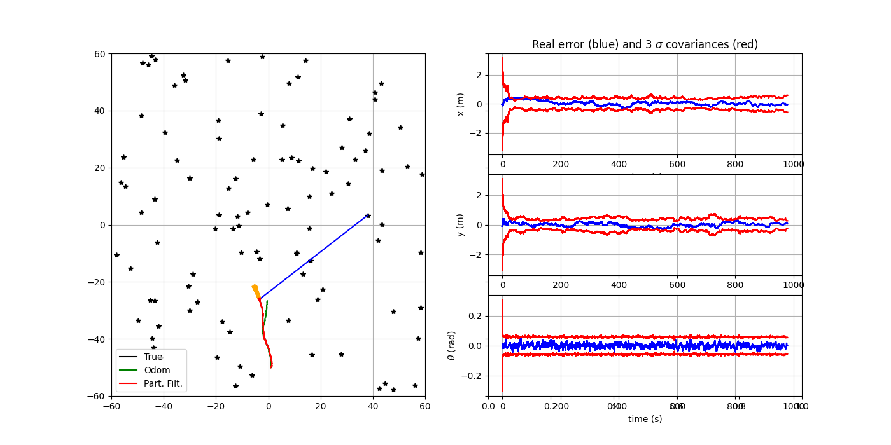
   
  <em>Figure 13 –  nLandmarks = 100 </em>

On constate qu’en accroissant le nombre d'amers dans l’environnement de simulation, il n'a pas beaucoup d'influence sur le resultat du filtre particulaire car l'erreur, la covariance et la trajectoire ne présentent pas des changements significatives. Tant que les particules sont bien réparties et que le modèle de capteur relie avec précision les mesures aux amers, le filtre peut fonctionner efficacement avec un nombre réduit d'amers en se concentrant sur les mises à jour probabilistes, plutôt que sur un grand ensemble de points de référence.    

