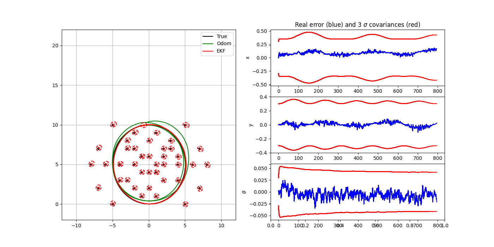
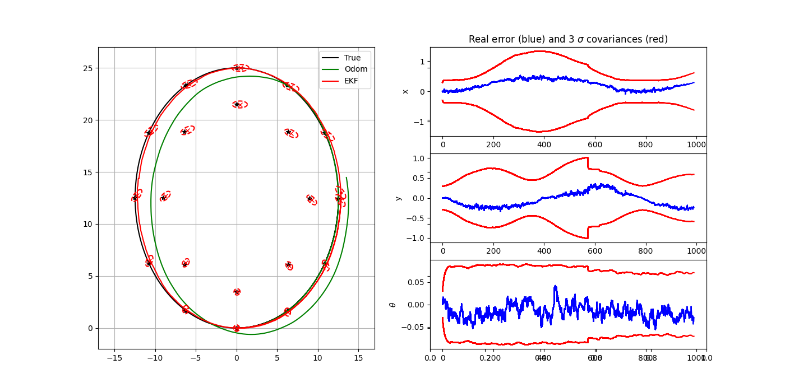
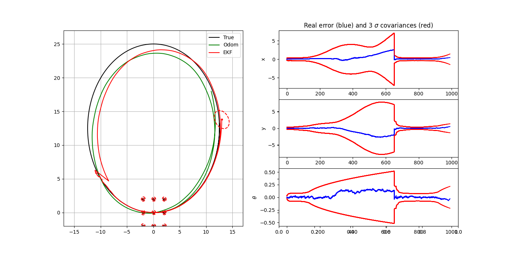
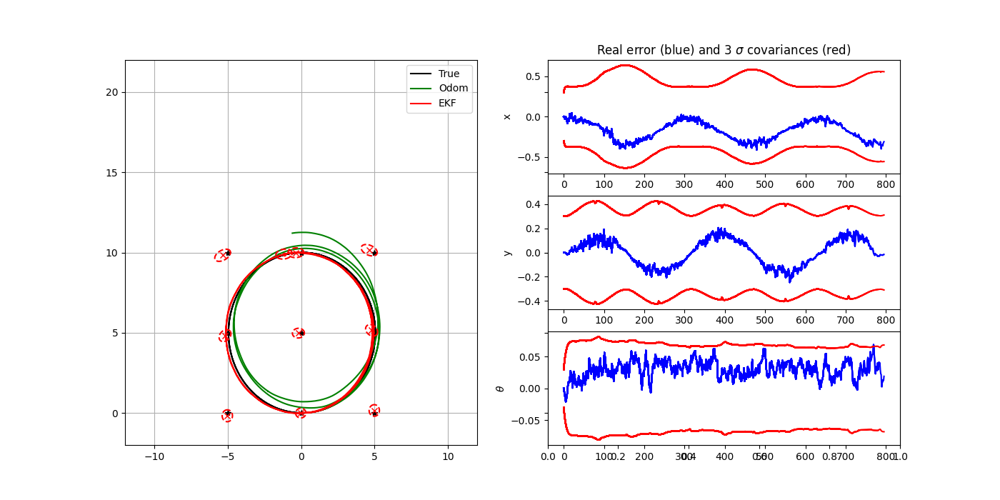
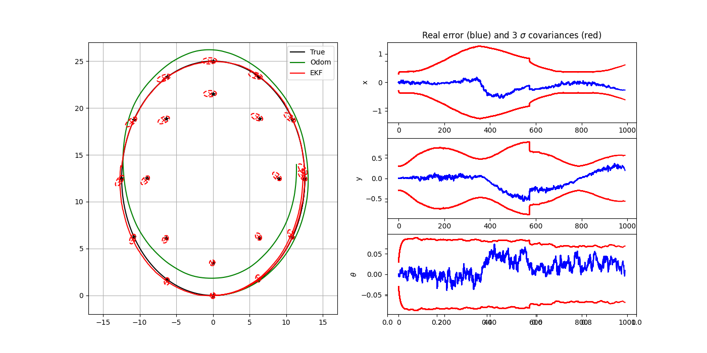
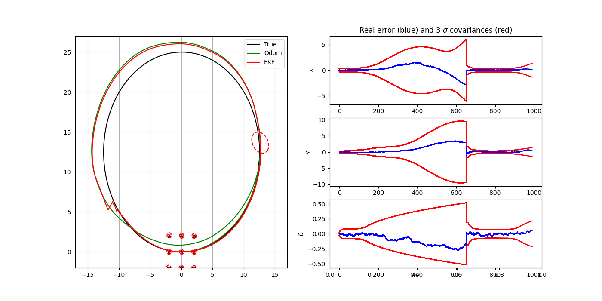
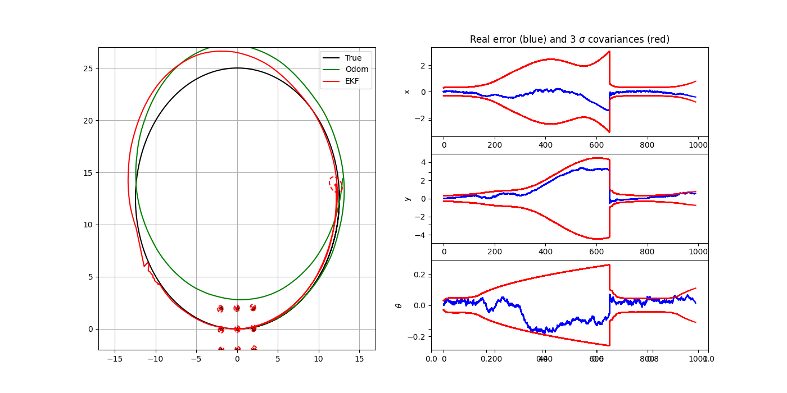
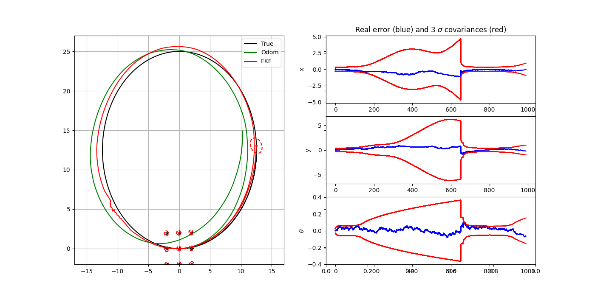
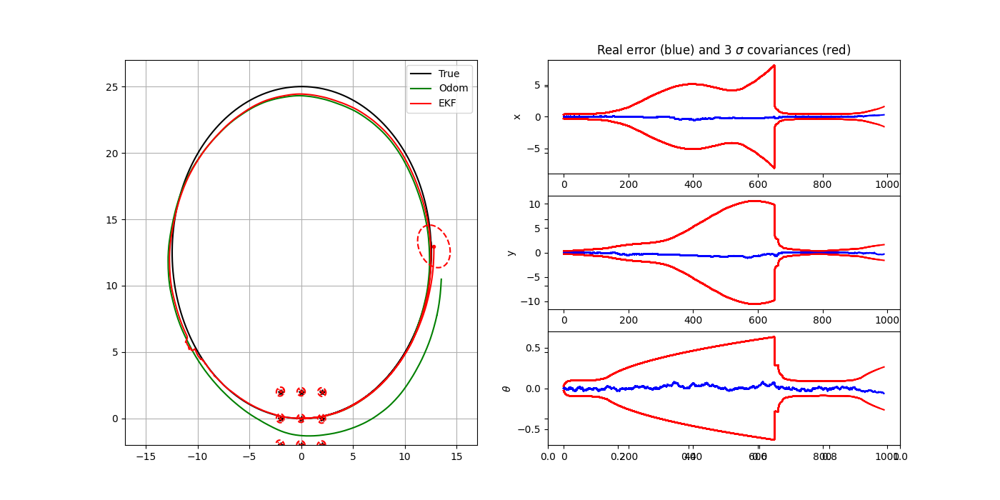

# TP EKF

## Question 1

For this question we'll modify the number and position of landmarks and the robot trajectory for:

#### A short loop and a dense map with many landmarks inside the robot perception radius

  
   
  <em>Figure 1 – A short loop and a dense map with many landmarks inside the robot perception radius </em>

In this case it's possible to see that the map quality seems very good, since the robot frequently re-sees many nearby landmarks, the filter gets lots of informative updates.
The error evolution stays very small and inside the covariance bounds. When the robot returns near the start, it's possible to see a small, smooth correction in the estimated trajectory toward the true.

#### A long loop and a dense map with many landmarks all along the loop

  
   
  <em>Figure 2 – A long loop and a dense map with many landmarks all along the loop </em>

For the long loop with landmarks distributed along the path, the EKF-SLAM maintains reasonable accuracy throughout the trajectory. Pose uncertainty increases gradually while moving away from known landmarks and drops sharply upon loop closure, demonstrating effective map correction and consistent filter behavior.

#### A long loop and a sparse map with only few landmarks near the start position

  
   
  <em>Figure 3 – A long loop and a sparse map with only few landmarks near the start position </em>

In the long-loop sparse-map experiment, the EKF-SLAM shows significant drift while landmarks are not visible, leading to large uncertainty growth. When the robot re-enters the region containing the few known landmarks, a strong loop-closure correction occurs, sharply reducing both the error and covariance. This demonstrates how insufficient landmark coverage degrades map accuracy and increases reliance on loop closure for correction.

## Question 2

Now we'll analyse the same situations as in Question 1 but  when the data association is performed using the Mahalanobis distance (KNOWN_DATA_ASSOCIATION = 0)

#### A short loop and a dense map with many landmarks inside the robot perception radius

  
   
  <em>Figure 4 – A short loop and a dense map with many landmarks inside the robot perception radius with KNOWN_DATA_ASSOCIATION = 0 </em>

Even without known IDs, nearest-neighbor association remains reliable in a dense, well-observed loop: pose errors stay within the covariance limits, but slightly higher than Question 1 and the map remains consistent, with loop closure causing only small, smooth corrections.

#### A long loop and a dense map with many landmarks all along the loop

  
   
  <em>Figure 5 – A long loop and a dense map with many landmarks all along the loop with KNOWN_DATA_ASSOCIATION = 0 </em>

With unknown data association on a long, landmark-dense loop, EKF-SLAM remains accurate and largely consistent: pose errors grow slowly during the outbound leg and contract at loop closure, confirming that dense, well-distributed features let simple nearest-neighbor association succeed without ground-truth IDs.

#### A long loop and a sparse map with only few landmarks near the start position

  
   
  <em>Figure 6 – A long loop and a sparse map with only few landmarks near the start position with KNOWN_DATA_ASSOCIATION = 0 </em>

With unknown data association and only a few landmarks near the start, EKF suffers substantial drift during the long unobserved loop. Upon re-entering the landmark region, loop closure produces a large correction and rapid covariance contraction. The scenario is brittle to data-association errors, but in this run the filter remains largely consistent after closure.

## Question 3 

#### Q and Py smaller than the values used for simulation (Q_Sim and Py_Sim)

  
   
  <em>Figure 6 – A long loop and a sparse map with only few landmarks near the start position with KNOWN_DATA_ASSOCIATION = 0 with Q and Py = 0.5 </em>

#### Q and Py equal to the values used for simulation (Q_Sim and Py_Sim)

  
   
  <em>Figure 6 – A long loop and a sparse map with only few landmarks near the start position with KNOWN_DATA_ASSOCIATION = 0 with Q and Py = 1  </em>

#### Q and Py larger than the values used for simulation (Q_Sim and Py_Sim)

  
   
  <em>Figure 6 – A long loop and a sparse map with only few landmarks near the start position with KNOWN_DATA_ASSOCIATION = 0 with Q and Py = 3 </em>

In the long-loop, sparse-map, unknown-association scenario, using Q and Py equal or slightly larger than the true simulator noises yields the best trade-off: the filter is consistent, loop closure is reliable, and the map remains clean. Assuming noises too small makes the EKF overconfident, producing inconsistent estimates and duplicate landmarks, while setting them too large makes association too permissive and risks wrong matches that can corrupt the map.

## Question 4

In this part of the experiment, the EKF-SLAM algorithm was modified to operate in a bearing-only configuration using the principle of undelayed initialization (UDI). Instead of relying on both range and bearing measurements, the filter processed only the direction (angle) of each observed landmark. Since a single bearing measurement does not determine a landmark’s position, several hypotheses were initialized along the perceived direction, each assigned an increasing distance and a large covariance in the radial direction. As the robot moved and obtained multiple observations from different viewpoints, these hypotheses were updated, with the most consistent one being reinforced while the others were gradually pruned. This approach enabled the filter to begin incorporating information without waiting for range estimation. In the simulation with a single landmark, multiple hypotheses were initially generated along the observation ray, but as the robot trajectory evolved, one estimate converged toward the true landmark position. The final map contained a single landmark with an elongated covariance ellipse aligned with the line of sight, indicating residual range uncertainty. The estimated trajectory remained close to the true path, and the error curves stayed within the predicted uncertainty bounds, demonstrating that the bearing-only EKF-SLAM with undelayed initialization maintained consistency and stable performance despite the limited measurement information.

The code can be found in 'ekf_slam_Q4.py'